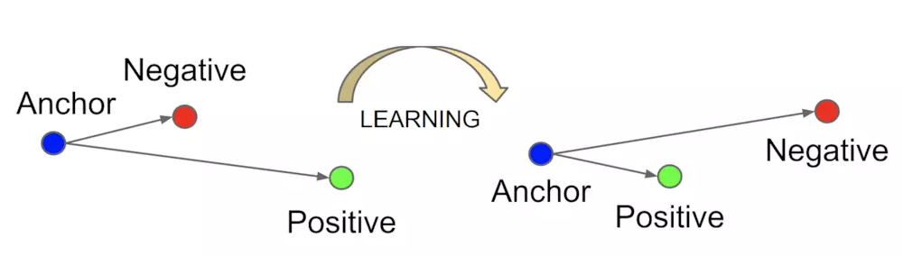

# 模型

## 基本网络结构

本程序在神经网络的结构与深度上进行了若干次尝试，从基本的 `vgg-16` 开始，进而尝试使用 `Inception_V2`[$^{[9]}$](#references) 模块，之后了解近几年 CV 领域一些里程碑式的新模型，比如 `Xception`[$^{[11]}$](#references) 、 `ResNeXt`[$^{[12]}$](#references) 、`MobileNet`[$^{[13]}$](#references) 等等

经过若干测试，最终保留了 `Inception_v2` （ModelV1）、 `Xception`（ModelV2） 与 `???`（ModelV4）（自己瞎弄的无名小网络），不过最后这个网络确实在测试过程中效果最佳，但也许只是因为模型还比较浅，整体结构比较简单罢了

其中 `Xception` 与 `???` 均保留了基本版本与深度版本，但是由于两个深度版本（V3 和 V5）表现并不是很好，所以后续并不会提及这两个深度版本

除了网络结构，在激活函数的选择上也做了一定的取舍，考虑到 `ReLU` 是一个性能与效果都非常好的激活函数，一般网络的激活均使用了 `ReLU` ，此外，在两篇 Paper[$^{[1][3]}$](#references) 中都有提到 `maxout` [$^{[4]}$](#references) ，经测试，其效果确实优于 `ReLU` 激活函数，但由于其应用不广，仅在部分网络输出之前以及 `???` 使用

?> maxout 具体实现参考 [$^{[7]}$](#references) 与 `tf.contrib.layers.maxout` 源码

## 网络流程图

?> 默认使用 ModelV4 （Nnet_v1），修改训练模型需要修改 `model.Model` 的父类，修改测试模型需要修改 `model_dir` （默认 `data/ckpt/`）相关配置

### Inception

也即 ModelV1

| layer        | size-in       | kernel                   | size-out      |
| ------------ | ------------- | ------------------------ | ------------- |
| CONV1        | (129, 49, 1)  | (3, 3, 32), s=1, "same"  | (129, 49, 32) |
| POOL1        | (129, 49, 32) | (3, 3), s=2              | (65, 25, 32)  |
| INCEPTION_2a | (65, 25, 32)  | (3, 3, 64), s=1, "same"  | (65, 25, 64)  |
| INCEPTION_2b | (65, 25, 64)  | (3, 3, 64), s=1, "same"  | (65, 25, 64)  |
| POOL2        | (65, 25, 64)  | (3, 3), s=2              | (33, 13, 64)  |
| INCEPTION_3a | (33, 13, 64)  | (3, 3, 128), s=1, "same" | (33, 13, 128) |
| INCEPTION_3b | (33, 13, 128) | (3, 3, 128), s=1, "same" | (33, 13, 128) |
| POOL3        | (33, 13, 128) | (3, 3), s=2              | (17, 7, 128)  |
| INCEPTION_4a | (17, 7, 128)  | (3, 3, 256), s=1, "same" | (17, 7, 256)  |
| INCEPTION_4b | (17, 7, 256)  | (3, 3, 256), s=1, "same" | (17, 7, 256)  |
| INCEPTION_4c | (17, 7, 256)  | (3, 3, 256), s=1, "same" | (17, 7, 256)  |
| POOL4        | (17, 7, 256)  | (3, 3), s=2              | (9, 4, 256)   |
| MAXOUT       | (9, 4, 256)   | k=2                      | (9, 4, 128)   |
| DW_CONV      | (9, 4, 128)   | (9, 4), s=1, "valid"     | (1, 1, 128)   |
| Flatten      | (1, 1, 128)   |                          | (128, )       |
| l2_norm      | (128, )       |                          | (128, )       |

> TIP
> -  所有激活函数均选择 ReLU
> -  使用可分离卷积代替全局池化（参考 MobileNet）
> -  两个模块之间有残差连接，如果两个模块 shape 不一样，则使用 $1 \times 1$ 卷积进行调节（参考 Inception_v4 [$^{[10]}$](#references)）
> -  所有池化均使用 $3 \times 3$ 卷积核并且 $stride = 2$、$padding="same"$ （参考 Xception 论文）
> -  所有卷积层均使用 Batch_Normalization（参考 Inception_v2）

### Xception

也即 ModelV2

| layer            | size-in       | kernel                   | size-out      |
| ---------------- | ------------- | ------------------------ | ------------- |
| CONV1            | (129, 49, 1)  | (3, 3, 32), s=1, "same"  | (129, 49, 32) |
| POOL1            | (129, 49, 32) | (3, 3), s=2              | (65, 25, 32)  |
| Separable_CONV2a | (65, 25, 32)  | (3, 3, 64), s=1, "same"  | (65, 25, 64)  |
| Separable_CONV2b | (65, 25, 64)  | (3, 3, 128), s=1, "same" | (65, 25, 128) |
| POOL2            | (65, 25, 64)  | (3, 3), s=2              | (33, 13, 64)  |
| Separable_CONV3a | (33, 13, 128) | (3, 3, 128), s=1, "same" | (33, 13, 128) |
| Separable_CONV3b | (33, 13, 128) | (3, 3, 128), s=1, "same" | (33, 13, 128) |
| Separable_CONV3c | (33, 13, 128) | (3, 3, 128), s=1, "same" | (33, 13, 128) |
| Separable_CONV4a | (33, 13, 128) | (3, 3, 128), s=1, "same" | (33, 13, 128) |
| Separable_CONV4b | (33, 13, 128) | (3, 3, 128), s=1, "same" | (33, 13, 128) |
| POOL3            | (33, 13, 128) | (3, 3), s=2              | (17, 7, 128)  |
| Separable_CONV5a | (17, 7, 128)  | (3, 3, 256), s=1, "same" | (17, 7, 256)  |
| Separable_CONV5a | (17, 7, 256)  | (3, 3, 256), s=1, "same" | (17, 7, 256)  |
| POOL4            | (17, 7, 256)  | (3, 3), s=2              | (9, 4, 256)   |
| MAXOUT           | (9, 4, 256)   | k=2                      | (9, 4, 128)   |
| DW_CONV          | (9, 4, 128)   | (9, 4), s=1, "valid"     | (1, 1, 128)   |
| Flatten          | (1, 1, 128)   |                          | (128, )       |
| l2_norm          | (128, )       |                          | (128, )       |

> TIP
> -  所有激活函数均选择 ReLU
> -  使用可分离卷积代替全局池化（参考 MobileNet）
> -  两个模块之间有残差连接，如果两个模块 shape 不一样，则使用 $1 \times 1$ 卷积进行调节（参考 Xception 论文）
> -  所有池化均使用 $3 \times 3$ 卷积核并且 $stride = 2$、$padding="same"$ （参考 Xception 论文）
> -  所有卷积层均使用 Batch_Normalization（参考 Inception_v2）

### ???

也即 ModelV4

| layer   | size-in      | params                   | size-out     |
| ------- | ------------ | ------------------------ | ------------ |
| ???_1   | (129, 49, 1) | (3, 3, 16), s=2, "same"  | (65, 25, 16) |
| ???_2a  | (65, 25, 16) | (3, 3, 16), s=1, "same"  | (65, 25, 16) |
| ???_2b  | (65, 25, 16) | (3, 3, 32), s=2, "same"  | (33, 13, 32) |
| ???_3a  | (33, 13, 32) | (3, 3, 32), s=1, "same"  | (33, 13, 32) |
| ???_3b  | (33, 13, 64) | (3, 3, 64), s=1, "same"  | (33, 13, 64) |
| ???_4a  | (33, 13, 32) | (3, 3, 64), s=1, "same"  | (33, 13, 64) |
| ???_4b  | (33, 13, 64) | (3, 3, 128), s=2, "same" | (17, 7, 128) |
| ???_5a  | (17, 7, 128) | (3, 3, 128), s=1, "same" | (17, 7, 128) |
| ???_5b  | (17, 7, 128) | (3, 3, 128), s=2, "same" | (9, 4, 128)  |
| DW_CONV | (9, 4, 128)  | (9, 4), s=1, "valid"     | (1, 1, 128)  |
| Flatten | (1, 1, 128)  |                          | (128, )      |
| l2_norm | (128, )      |                          | (128, )      |

>  WARNING 模块设计的一些细节
>
> 虽然网络设计简单了，事实上该模块内部做了不少事情，首先陈述以下事实：
> -  Average_pooling 等价于卷积核全为 1 的可分离卷积，所以可分离卷积会比 Average_pooling 做的更好（参考 MobileNet）
> -  $f \times f$ 的普通卷积等价于 $f \times f$ 的可分离卷积 + $1 \times 1$ 的普通卷积，并参数更少（参考 Xception）
> -  $3 \times 3$ 卷积等价于最外两圈全是零的 $5 \times 5$ 卷积，也等价于两次 $3 \times 3$ 卷积且第二个卷积核中间为 $1$ 外圈为 $0$ ，所以，大的感受野总是优于小的感受野，同时大的感受野是可以被多层小的感受野所替换的（参考 Inception_v2）
> -  BN 使得层与层之间解耦
> -  Max_pooling 与 Maxout 都有着比较好的效果
> -  ResNets 能够保留前层特征用于后层的组合，以学习到更丰富的特征
> -  Inception Xception 以及 ResNeXt 都对通道进行了一定的分离，取得了可观的效果
>
> 基于以上事实，每个 ??? 模块对输入的 Feature Map 做以下变换
>
> 1. 首先进行 $1 \times 1$ 卷积降低通道数，形成瓶颈层以降低运算量，之后对瓶颈层进行 $3 \times 3$ 可分离卷积，同时从输入计算残差，将残差与可分离卷积结果在 channel 上拼接
> 2. 如果该层需要对 size 进行缩减的话，对刚刚拼接的结果进行两次 $1 \times 1$ 卷积，两个结果分别进行最大池化与可分离卷积，然后在通道上进行拼接
> 3. 如果该层需要非线性激活的话，对刚刚拼接的结果进行两次 $1 \times 1$ 卷积，对其中一个结果进行 maxout 激活（k = 4），然后与另一个结果在通道轴上进行拼接
> 4. 最后对结果进行 Batch_Normalization

更多细节参见[`model/triplet-model.py`](https://github.com/zsync/shoeprint-recognition/blob/master/model/triplet_model.py#L273-L310)

> TIP 为什么这样会有效？我猜想有下原因
>
> -  更多的超参数是由网络自行学习的，比如是不是需要残差、是选用最大池化还是可分离卷积、需不需要激活、怎么激活
> -  即使该模块进行了激活，也有可能有一部分未激活的特征流入下一层，两层卷积可以提高感受野
> -  可能有一部分残差通过通道流入了下一层，低层次特征与高层次特征相互组合以组成更丰富的特征

!> 最开始的想法有点类似于近期了解的 DenseNet（比如其中的特征复用概念），改着改着就成了这样子，但是其实很多细节经不起考验，后期回想会发现很多不成熟的地方（有点像大杂烩？），所以有时间我也许会再重新想一下这里的细节部分

## loss 的计算

loss 采用 $Triplet Loss$ [$^{[5]}$](#references) ，也即 $L(A, P, N) = max(|| f(A) - f(P) ||^2 - || f(A) - f(N)||^2 + \alpha, 0)$ ，具体实现参考 [$^{[6]}$](#references) ，但是该方法对三元组的挑选并非在线评估选取，故三元组的在线选取参考了 [$^{[8]}$](#references)

?> 在 triplet loss 的实现过程中踩了很多很多坑，起初使用离线生成的三元组进行训练，结果训练集很容易过拟合，在开发集上的表现就是什么都没有学到，准确率接近于瞎猜（1/50），后来采用了**在线生成**方才解决该问题，但是当前准确率依然不高（比较好的模型大概稳定在 45%）

# References {docsify-ignore}

1. 张弛. [基于卷积神经网络的鞋印图像分类算法研究](https://kns.cnki.net/KCMS/detail/detail.aspx?dbcode=CMFD&dbname=CMFD201602&filename=1016056867.nh)
2. Simonyan, Zisserman. [Very deep convolutional networks for large-scale image recognition, arXiv:1409.1556, 2015](https://arxiv.org/pdf/1409.1556)
3. Florian Schroff, Dmitry Kalenichenko, James Philbin. [FaceNet: A Unified Embedding for Face Recognition and Clustering, arXiv:1503.03832, CVPR 2015](https://arxiv.org/pdf/1503.03832)
4. Ian J. Goodfellow, David Warde-Farley, Mehdi Mirza, Aaron Courville, Yoshua Bengio. [Maxout Networks, arXiv:1302.4389, 2013](https://arxiv.org/pdf/1302.4389)
5. Yaniv Taigman, Ming Yang, Marc'Aurelio Ranzato, Lior Wolf. [DeepFace closing the gap to human level performance, CVPR 2014](https://www.researchgate.net/publication/263564119_DeepFace_Closing_the_Gap_to_Human-Level_Performance_in_Face_Verification)
6. [triplet-loss-mnist](https://github.com/SpikeKing/triplet-loss-mnist)
7. [How to use maxout activation function in tensorflow?](https://stackoverflow.com/questions/39954793/how-to-use-maxout-activation-function-in-tensorflow)
8. [FaceNet（一）---Triplet Loss](https://blog.csdn.net/baidu_27643275/article/details/79222206)
9.   Sergey Ioffe, Christian Szegedy. [Batch Normalization, arXiv:1502.03167, 2015](https://arxiv.org/pdf/1502.03167.pdf)
10.   Christian Szegedy, Sergey Ioffe, Vincent Vanhoucke. [Inception-v4, Inception-ResNet, arXiv:1602.07261, 2016](https://arxiv.org/pdf/1602.07261.pdf)
11.   Franc¸ois Chollet. [Xception: Deep Learning with Depthwise Separable Convolutions, arXiv:1610.02357, 2016](https://arxiv.org/pdf/1610.02357.pdf)
12.   Saining Xie, Ross Girshick, Piotr Dollar, Zhuowen Tu, Kaiming He. [Aggregated Residual Transformations for Deep Neural Networks, arXiv:1611.05431, 2016](https://arxiv.org/pdf/1611.05431.pdf)
13.   Andrew G. Howard, Menglong Zhu, Bo Chen,  Dmitry Kalenichenko,  Dmitry Kalenichenko,  Tobias Weyand, Marco Andreetto,  Hartwig Adam. [MobileNets: Efficient Convolutional Neural Networks for Mobile Vision Applications, arXiv:1704.04861, 2017](https://arxiv.org/pdf/1704.04861.pdf)
