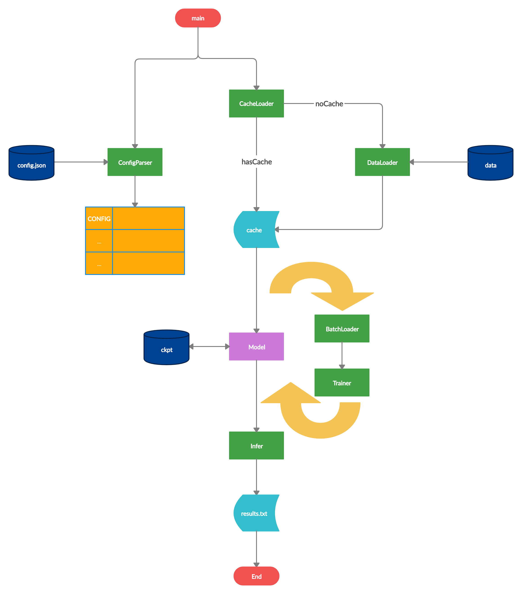

# 快速开始

## 视频速览

<iframe src="//player.bilibili.com/player.html?high_quality=1&aid=66645569" allowfullscreen="allowfullscreen" width="100%" height="500" scrolling="no" frameborder="0" sandbox="allow-top-navigation allow-same-origin allow-forms allow-scripts"></iframe>

## 环境配置

### 安装依赖

```bash
pip install -r requirements.txt
```

?> 如果有条件，可以安装 `tensorflow-gpu`

### 编译链接库

``` bash
python setup.py build_ext -i
```

由于训练时使用了弹性形变扩增，暂时未找到在 Python 下的高效扩增方式，故使用 Cython 加速遍历过程

### 文件说明及路径配置

可按照 `config.json` 对文件进行配置，默认配置如下

```
.
├── data
│   ├── cache
│   │   ├── cache_loader/
│   │   ├── data_set.h5
│   │   └── indices.json
│   ├── ckpt
│   ├── sample_pics              （训练、测试必配置）
│   │   ├── C151224000005
│   │   ├── C151224000012
│   │   └── ...
│   ├── test
│   │   ├── test_2               （测试必配置）
│   │   │   ├── C151224000012
│   │   │   └── ...
│   │   ├── test_剪切图
│   │   └── test_原图
│   ├── train
│   │   ├── train_2              （训练必配置）
│   │   │   ├── C151224000012
│   │   │   └── ...
│   │   ├── train_剪切图
│   │   └── train_原图
│   ├── txt
│   │   ├── 索引.txt             （测试必配置）
│   │   └── 训练.txt             （训练必配置）
│   └── result.txt               （测试必配置）
├── docs/
├── scripts/
├── config_parser/
├── data_loader/
├── infer/
├── model/
├── trainer/
├── config.json
└── main.py
```

下面对各个文件进行说明

-  `docs/` 文档文件夹，使用 Markdown 书写， Docsify 驱动
-  `scripts/` 部分脚本，仅起到某些命令的简化作用，对本项目无实质性的帮助
-  `config.json` 配置文件，用于配置文件路径、训练超参数、图片参数等
-  `main.py` 入口函数，用于解析参数
-  `config_parser/` 配置解析库
   -  `base.py` 配置基类
   -  `config.py` 对 `config.json` 进行初步解析
-  `data_loader/` 数据提取库，包含以下三个主模块
   -  `base.py` 缓存装饰器，用于生成数据一级 pickle 缓存，以提高数据获取速度
   -  `data_loader.py` 原数据提取器，用于从原数据文件中提取需要的数据，大多数使用了缓存装饰器，其中 `data_import` 使用了二级缓存（h5 和 json）提高读取速度
   -  `image.py` 图片处理模块，主要用于图片的 resize 与扩增
   -  `batch_loader.py` 三元组在线生成器（确实是个生成器）
-  `model/` 模型库
   -  `base.py` 模型基类
   -  `triplet_model.py` 对本问题的衍生类，封装了本问题所需要的大多数方法以及初始化方法
   -  `models.py` 模型类文件，每个类对应一个模型
-  `trainer/` 训练库，暂未进行模块化封装
   -  `train.py` 训练时的主函数文件
   -  `recorder.py` 训练记录器，记录训练断点与模型性能
-  `infer/` 测试库，暂未进行模块化封装
   -  `test.py` 测试时的主函数文件
-  `data` 数据文件夹
   -  `cache/` 缓存文件夹
      -  `cache_loader/` `data_loader/base.py` 默认生成的缓存文件夹，可通过修改 `paths.cache_loader_dir` 进行变更
      -  `data_set.h5` `data_loader/data_loader.data_import` 默认生成的二级图片缓存，可通过修改 `paths.h5_path` 进行变更
      -  `indices.json` `data_loader/data_loader.data_import` 默认生成的二级索引缓存，可通过修改 `paths.json_path` 进行变更
   -  `ckpt/` **模型文件夹**，训练时会将模型保存在该文件夹下，测试时会使用该文件夹下的模型，可通过修改 `paths.model_dir` 进行变更
   -  `sample_pics/` **样本图库文件夹**，请训练与测试时将图片存放到该文件夹下，可通过修改 `paths.sample_dir` 进行变更
   -  `train/train_2/` **训练鞋印图库文件夹**，可通过修改 `paths.shoeprint_dir` 进行变更
   -  `test/test_2/` **测试鞋印图库文件夹**，可通过修改 `paths.shoeprint_test_dir` 进行变更
   -  `txt/训练.txt` **训练待判定范围文本文件**，可通过修改 `paths.determine_file` 进行变更
   -  `txt/索引.txt` **测试待判定范围文本文件**，可通过修改 `paths.determine_test_file` 进行变更
   -  `result.txt` **测试输出文本文件**，可通过修改 `paths.result_file` 进行变更

> TIP
> -  路径分隔符尽量使用 \*nix 风格的 `/` 而不是 Windows 风格的 `\` ，如果一定要使用 `\` ，记得转义为 `\\`
> -  文件夹路径建议以分隔符（`/`）结尾
> -  请尽量不要在包含图片的路径中出现中文，否则可能会引发 cv2 无法读取图片的问题

### 程序流程图



?> 只是大致表征了各模块之间的关系，并不是程序的真实逻辑关系

### 其他配置

-  `train`
   -  `learning_rate` 训练时的学习率，训练过程中可调整（一般初始设为 1e-4 ，逐渐降低到 1e-6）
   -  `num_epochs` 迭代代数
   -  `keep_prob` dropout 留存率，训练过程不可调整（由于现在没有使用全连接网络，也就没有使用 dropout ，所以该参数无效）
   -  `class_per_batch` 在线生成三元组时，每批数据的图片类别数
   -  `shoe_per_class` 在线生成三元组时，每类图片中挑选的图片数
   -  `img_per_class` 在线生成三元组时，每张图片的扩增数
   -  `emb_step` 计算嵌入时每小批数据的样本数
   -  `save_step` 每训练多少代保存一次参数
   -  `test_step` 每训练多少代测试一次效果
   -  `max_to_keep` 模型最大保存次数
   -  `train_test` 是否使用训练集数据进行测试
   -  `dev_test` 是否使用开发集数据进行测试
-  `test`
   -  `log` 测试时是否打印每个图片的效果
   -  `plot` 测试时是否显示图片（原图、真实样本、猜测样本）
   -  `separator` 输入文件中的分隔符
-  `image`
   -  `W` 神经网络接收的图片宽度
   -  `H` 神经网络接收的图片高度
-  `margin` triplet-loss 间隔大小
-  `seed` 随机种子
-  `debug` 是否启用 CacheLoader

## 启动

### 训练

```bash
python main.py train
```

额外参数

-  `--resume` 继续上次的模型进行训练
-  `--no-gpu` 不使用 GPU 进行训练

### 测试

```bash
python main.py test
```

额外参数

-  `--no-gpu` 不使用 GPU 计算嵌入
-  `--use-cache` 使用之前已经计算过的嵌入缓存

### 文档实时预览

```bash
python main.py docs
```
